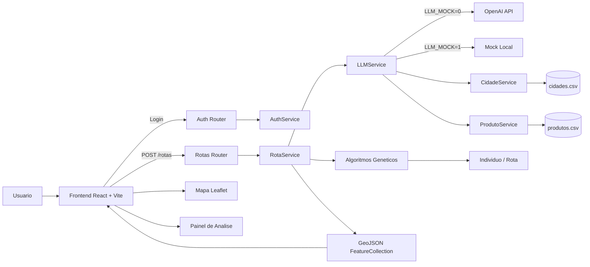
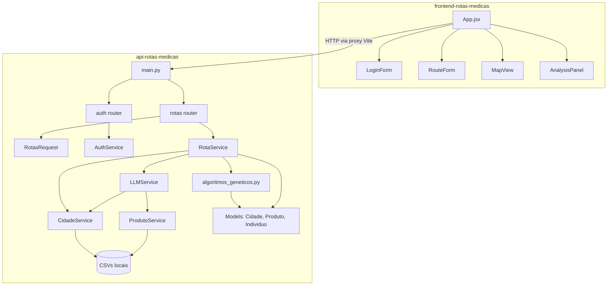
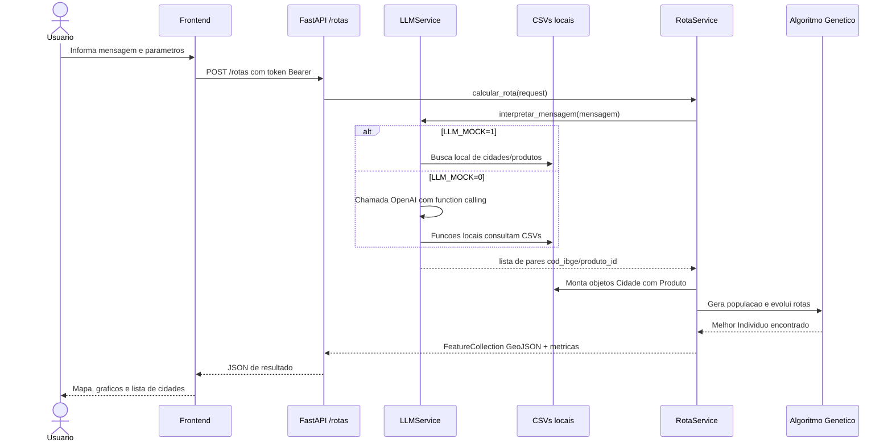
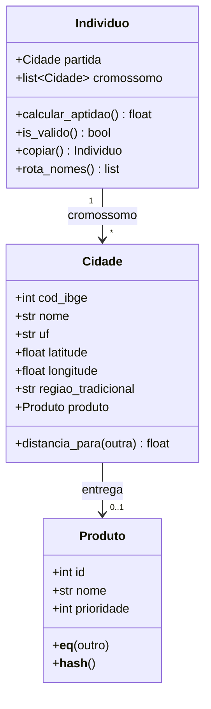
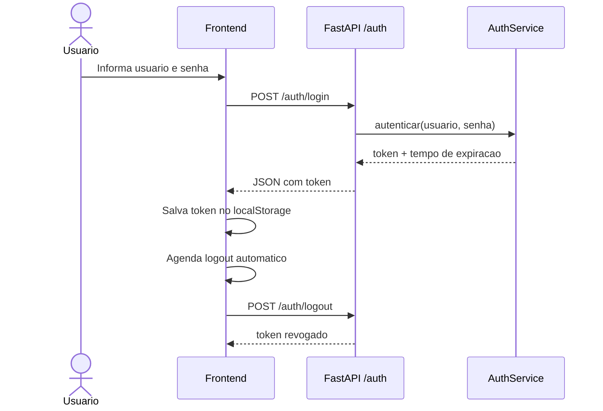
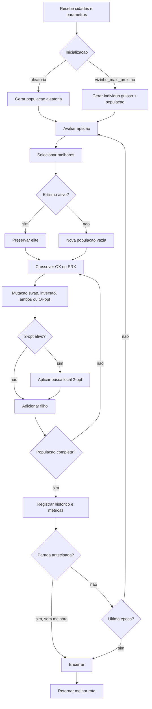
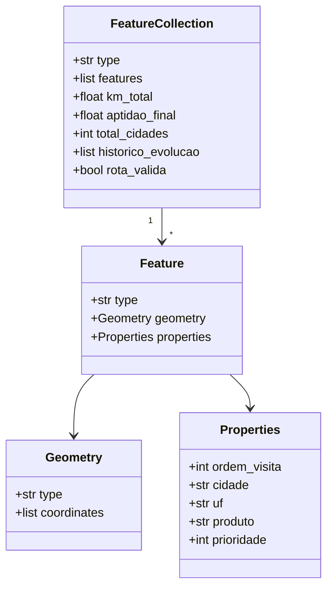

# Sistema de Otimizacao de Rotas Medicas

Projeto da Fase 2 da pos-graduacao FIAP - IA para Devs. A aplicacao otimiza rotas de entrega de medicamentos, vacinas e insumos medicos usando Algoritmos Geneticos para uma variacao do Problema do Caixeiro Viajante (TSP).

## Integrantes

- Gustavo Denobi
- Gilberto Cunha
- Thiago Garbulha
- Vitor Arruda

## Visao Geral

O sistema possui duas partes:

- `api-rotas-medicas/`: API FastAPI responsavel por autenticacao, interpretacao da mensagem, execucao do algoritmo genetico e retorno da rota em GeoJSON.
- `frontend-rotas-medicas/`: frontend React + Vite responsavel por login, formulario de parametros, mapa Leaflet e painel de analise.

Fluxo principal:

1. O usuario faz login.
2. O usuario descreve uma rota em linguagem natural.
3. A API interpreta a mensagem via LLM ou mock local.
4. A API monta as cidades/produtos usando os CSVs locais.
5. O algoritmo genetico otimiza a rota.
6. O frontend exibe a rota no mapa e os graficos de evolucao.

## Documentacao Tecnica e Arquitetura

A aplicacao segue uma arquitetura cliente-servidor. O frontend coleta a descricao da rota e os parametros do algoritmo, a API interpreta a mensagem, monta os dados de entrada, executa o Algoritmo Genetico e devolve uma resposta GeoJSON para ser exibida no mapa e no painel de analise.

### Diagrama de Arquitetura Geral



Componentes principais:

- `frontend-rotas-medicas/`: interface web com login, formulario de parametros, mapa Leaflet e painel de metricas.
- `api-rotas-medicas/main.py`: ponto de entrada da API FastAPI, configuracao de CORS, routers e health check.
- `api-rotas-medicas/api/routers/`: endpoints HTTP de autenticacao e calculo de rotas.
- `api-rotas-medicas/api/schemas/`: validacao dos dados de entrada com Pydantic.
- `api-rotas-medicas/services/llm_service.py`: interpreta a mensagem do usuario via OpenAI ou mock local.
- `api-rotas-medicas/services/cidade_service.py`: carrega e consulta cidades do CSV local.
- `api-rotas-medicas/services/produto_service.py`: carrega e consulta produtos do CSV local.
- `api-rotas-medicas/services/rota_service.py`: orquestra interpretacao da mensagem, montagem das cidades, execucao do algoritmo genetico e montagem da resposta GeoJSON.
- `api-rotas-medicas/services/algoritmos_geneticos.py`: contem inicializacao, selecao, crossover, mutacao, busca local e estatisticas da populacao.
- `api-rotas-medicas/models/`: modelos de dominio, como `Cidade`, `Produto` e `Individuo`.
- `api-rotas-medicas/data/`: base local em CSV usada pela aplicacao.

### Diagrama de Componentes



### Fluxo de Calculo da Rota



### UML de Dominio



### Fluxo de Autenticacao



### Fluxo do Algoritmo Genetico



### Formato da Resposta

O backend retorna um objeto `FeatureCollection`, formato padrao de dados geograficos. Cada cidade visitada e representada como uma `Feature` com coordenadas e propriedades usadas no mapa e na lista de rota.



## Decisoes de Implementacao

- **FastAPI no backend**: escolhido por facilitar a criacao de endpoints REST, validacao com Pydantic e execucao local simples com Uvicorn.
- **React + Vite no frontend**: escolhido para criar uma interface interativa, com atualizacao rapida em desenvolvimento e boa integracao com componentes de mapa e graficos.
- **Leaflet para mapa**: usado para exibir marcadores das cidades e a linha da rota otimizada de forma interativa.
- **GeoJSON como formato de resposta**: facilita a comunicacao entre backend e mapa, pois e um formato padrao para dados geograficos.
- **CSVs locais para cidades e produtos**: simplificam a execucao do projeto sem depender de banco de dados externo.
- **LLM com function calling**: a OpenAI interpreta a mensagem em linguagem natural e usa funcoes locais para pesquisar cidades/produtos nos dados do projeto.
- **Mock local do LLM**: permite testar e demonstrar o sistema sem consumir cota da OpenAI, mantendo o restante do fluxo igual ao modo real.
- **Algoritmo Genetico para TSP**: cada individuo representa uma rota circular; a populacao evolui por selecao, crossover e mutacao ate encontrar uma rota melhor.
- **Prioridade como criterio de otimizacao suave**: produtos de prioridade 1 recebem bonificacao para aparecerem mais cedo, mas isso nao e uma regra rigida; o algoritmo equilibra prioridade e distancia total.
- **Elitismo e parada antecipada opcionais**: ajudam a preservar boas solucoes e evitar execucoes desnecessarias quando a evolucao estabiliza.
- **2-opt opcional**: aplica busca local para melhorar rotas, mas pode aumentar o custo computacional.

## Requisitos

- Python 3.11+
- Node.js 18+
- npm

## Backend

Entre na pasta da API:

```bash
cd api-rotas-medicas
```

Crie e ative um ambiente virtual:

```bash
python3 -m venv .venv
source .venv/bin/activate
```

Instale as dependencias:

```bash
pip install -r requirements.txt
```

Crie o arquivo `.env` com base no exemplo:

```bash
cp .env.example .env
```

Exemplo de `.env`:

```env
OPENAI_API_KEY=sua-chave-openai
MODELO_CHAT=gpt-4.1-mini
LLM_MOCK=0
AUTH_USUARIO=admin
AUTH_SENHA=admin
```

Para testar sem cota da OpenAI, use o mock local:

```env
LLM_MOCK=1
```

Com `LLM_MOCK=1`, a API nao chama a OpenAI. Ela tenta inferir cidades/produtos pela mensagem usando os CSVs locais e, se nao conseguir, usa uma lista padrao em `api-rotas-medicas/services/llm_service.py`.

Suba a API:

```bash
uvicorn main:app --reload
```

URL padrao:

```text
http://localhost:8000
```

Health check:

```bash
curl http://localhost:8000/health
```

## Frontend

Em outro terminal, entre na pasta do frontend:

```bash
cd frontend-rotas-medicas
```

Instale as dependencias:

```bash
npm install
```

Suba o frontend:

```bash
npm run dev
```

URL padrao:

```text
http://localhost:5173
```

O Vite possui proxy para a API em `localhost:8000`.

## Documentacao da API

A API tambem possui Swagger automatico do FastAPI quando o backend esta rodando:

```text
http://localhost:8000/docs
```

E a especificacao OpenAPI em:

```text
http://localhost:8000/openapi.json
```

Base URL local:

```text
http://localhost:8000
```

### Resumo dos Endpoints

| Metodo | Endpoint | Autenticacao | Descricao |
|---|---|---|---|
| `GET` | `/health` | Nao | Verifica se a API esta no ar. |
| `POST` | `/auth/login` | Nao | Autentica usuario/senha e retorna token. |
| `POST` | `/auth/logout` | Sim | Revoga o token atual. |
| `POST` | `/rotas/` | Sim | Calcula uma rota otimizada com Algoritmo Genetico. |

### `GET /health`

Verifica se a API esta ativa.

Exemplo:

```bash
curl http://localhost:8000/health
```

Resposta esperada:

```json
{
  "status": "ok",
  "versao": "1.0.0"
}
```

### `POST /auth/login`

Autentica com o usuario e senha configurados no `.env`.

Payload:

```json
{
  "usuario": "admin",
  "senha": "admin"
}
```

Exemplo:

```bash
curl -X POST http://localhost:8000/auth/login \
  -H "Content-Type: application/json" \
  -d '{
    "usuario": "admin",
    "senha": "admin"
  }'
```

Resposta esperada:

```json
{
  "token": "token-gerado-pela-api",
  "expires_in": 3600
}
```

Possiveis erros:

- `401 Unauthorized`: usuario ou senha invalidos.
- `422 Unprocessable Entity`: payload invalido.

### `POST /auth/logout`

Revoga o token atual. O token deve ser enviado no header `Authorization`.

Exemplo:

```bash
curl -X POST http://localhost:8000/auth/logout \
  -H "Authorization: Bearer SEU_TOKEN"
```

Resposta esperada:

```json
{
  "status": "ok"
}
```

Possiveis erros:

- `401 Unauthorized`: token ausente, invalido ou expirado.

### `POST /rotas/`

Calcula a rota otimizada. Este endpoint exige token Bearer.

Payload minimo recomendado:

```json
{
  "mensagem": "Monte uma rota para entregar vacinas da Covid em Sao Paulo, Campinas, Santos e Rio de Janeiro.",
  "epocas": 100,
  "elitismo": 1,
  "grau_mutacao": 1.0,
  "populacao_apenas_aleatoria": 0,
  "tamanho_populacao": 200,
  "tamanho_elite": 20,
  "tipo_selecao": "truncamento",
  "tipo_crossover": "ox",
  "tipo_mutacao": "ambos",
  "usar_2opt": 0,
  "tipo_inicializacao": "aleatoria",
  "usar_parada_antecipada": 0,
  "paciencia_parada_antecipada": 30
}
```

Exemplo:

```bash
curl -X POST http://localhost:8000/rotas/ \
  -H "Content-Type: application/json" \
  -H "Authorization: Bearer SEU_TOKEN" \
  -d '{
    "mensagem": "Monte uma rota para entregar vacinas da Covid em Sao Paulo, Campinas, Santos e Rio de Janeiro.",
    "epocas": 100,
    "elitismo": 1,
    "grau_mutacao": 1.0,
    "populacao_apenas_aleatoria": 0,
    "tamanho_populacao": 200,
    "tamanho_elite": 20,
    "tipo_selecao": "truncamento",
    "tipo_crossover": "ox",
    "tipo_mutacao": "ambos",
    "usar_2opt": 0,
    "tipo_inicializacao": "aleatoria",
    "usar_parada_antecipada": 0,
    "paciencia_parada_antecipada": 30
  }'
```

Exemplo completo com login e rota no terminal:

```bash
TOKEN=$(curl -s -X POST http://localhost:8000/auth/login \
  -H "Content-Type: application/json" \
  -d '{"usuario":"admin","senha":"admin"}' \
  | python3 -c "import sys,json; print(json.load(sys.stdin)['token'])")

curl -X POST http://localhost:8000/rotas/ \
  -H "Content-Type: application/json" \
  -H "Authorization: Bearer $TOKEN" \
  -d '{
    "mensagem": "Monte uma rota para entregar vacinas da Covid em Sao Paulo, Campinas, Santos e Rio de Janeiro.",
    "epocas": 100,
    "elitismo": 1,
    "grau_mutacao": 1.0,
    "populacao_apenas_aleatoria": 0,
    "tamanho_populacao": 200,
    "tamanho_elite": 20,
    "tipo_selecao": "truncamento",
    "tipo_crossover": "ox",
    "tipo_mutacao": "ambos",
    "usar_2opt": 0,
    "tipo_inicializacao": "aleatoria",
    "usar_parada_antecipada": 0,
    "paciencia_parada_antecipada": 30
  }'
```

Resposta resumida:

```json
{
  "type": "FeatureCollection",
  "features": [
    {
      "type": "Feature",
      "geometry": {
        "type": "Point",
        "coordinates": [-46.6333, -23.5505]
      },
      "properties": {
        "ordem_visita": 1,
        "cidade": "Sao Paulo",
        "uf": "SP",
        "produto": "Vacina da Covid",
        "prioridade": 1
      }
    }
  ],
  "km_total": 1200.5,
  "aptidao_final": 900.5,
  "total_cidades": 4,
  "historico_evolucao": [],
  "epocas_executadas": 100,
  "parou_antecipadamente": false,
  "total_avaliacoes_aptidao": 18000,
  "rota_valida": true,
  "cidades_prioridade_1": 4,
  "posicao_media_prioridade_1_percentual": 45.0,
  "cidades_prioridade_2": 0,
  "posicao_media_prioridade_2_percentual": null
}
```

Campos principais da resposta:

- `features`: pontos GeoJSON usados pelo mapa.
- `km_total`: distancia total da melhor rota.
- `aptidao_final`: valor usado pelo AG para comparar solucoes; menor e melhor.
- `historico_evolucao`: amostras de distancia, aptidao e diversidade ao longo das epocas.
- `rota_valida`: indica se a rota respeita os invariantes basicos.
- `cidades_prioridade_1` e `cidades_prioridade_2`: quantidades de cidades por prioridade.
- `posicao_media_prioridade_1_percentual` e `posicao_media_prioridade_2_percentual`: posicao media das prioridades dentro da rota.

Possiveis erros:

- `400 Bad Request`: nenhuma cidade encontrada ou quantidade insuficiente de cidades.
- `401 Unauthorized`: token ausente, invalido ou expirado.
- `422 Unprocessable Entity`: payload invalido, por exemplo `tamanho_elite >= tamanho_populacao`.

### Parametros do Endpoint `/rotas/`

| Campo | Tipo | Obrigatorio | Regra | Descricao |
|---|---|---|---|---|
| `mensagem` | `string` | Sim | 20 a 500 caracteres | Descricao textual da rota e produtos. |
| `epocas` | `int` | Nao | 1 a 100000 | Quantidade de geracoes do AG. |
| `elitismo` | `int` | Nao | `0` ou `1` | Preserva melhores individuos entre geracoes. |
| `grau_mutacao` | `float` | Sim | 0.0 a 10.0 | Percentual de mutacao. |
| `populacao_apenas_aleatoria` | `int` | Nao | `0` ou `1` | Campo mantido para compatibilidade. |
| `tamanho_populacao` | `int` | Nao | 1 a 10000 | Total de individuos por geracao. |
| `tamanho_elite` | `int` | Sim | menor que `tamanho_populacao` | Quantidade de melhores individuos selecionados. |
| `tipo_selecao` | `string` | Nao | `truncamento` ou `torneio` | Estrategia de selecao. |
| `tipo_crossover` | `string` | Nao | `ox` ou `erx` | Operador de cruzamento. |
| `tipo_mutacao` | `string` | Nao | `swap`, `inversao`, `ambos`, `or_opt` | Operador de mutacao. |
| `usar_2opt` | `int` | Nao | `0` ou `1` | Aplica busca local 2-opt. |
| `tipo_inicializacao` | `string` | Nao | `aleatoria` ou `vizinho_mais_proximo` | Forma de criar a populacao inicial. |
| `usar_parada_antecipada` | `int` | Nao | `0` ou `1` | Interrompe se nao houver melhora. |
| `paciencia_parada_antecipada` | `int` | Nao | 1 a 100000 | Epocas sem melhora toleradas. |

## Autenticacao

A aplicacao usa autenticacao simples com usuario e senha definidos no `.env`:

```env
AUTH_USUARIO=admin
AUTH_SENHA=admin
```

Endpoints:

- `POST /auth/login`: autentica e retorna um token.
- `POST /auth/logout`: revoga o token atual.
- `POST /rotas/`: endpoint protegido que calcula a rota otimizada.
- `GET /health`: verifica se a API esta no ar.

## Endpoint Principal

`POST /rotas/`

Recebe a mensagem da rota e parametros do algoritmo genetico, como:

- `epocas`
- `tamanho_populacao`
- `tamanho_elite`
- `grau_mutacao`
- `elitismo`
- `tipo_selecao`: `truncamento` ou `torneio`
- `tipo_crossover`: `ox` ou `erx`
- `tipo_mutacao`: `swap`, `inversao`, `ambos` ou `or_opt`
- `usar_2opt`
- `tipo_inicializacao`: `aleatoria` ou `vizinho_mais_proximo`
- `usar_parada_antecipada`

A resposta e um `FeatureCollection` GeoJSON com a rota, distancia total, historico de evolucao, metricas de aptidao e diagnostico de prioridade.

## Algoritmo Genetico

O algoritmo representa cada solucao como uma rota circular:

```text
cidade_partida -> cidade_1 -> cidade_2 -> ... -> cidade_partida
```

Principais caracteristicas:

- Populacao inicial aleatoria ou por vizinho mais proximo.
- Selecao por truncamento ou torneio.
- Crossover OX ou ERX.
- Mutacao por swap, inversao, ambos ou Or-opt.
- Busca local 2-opt opcional.
- Elitismo opcional.
- Parada antecipada opcional.
- Fitness baseado em distancia total e bonificacao para entregas de prioridade 1.

## Dados

Os dados locais ficam em:

- `api-rotas-medicas/data/cidades.csv`
- `api-rotas-medicas/data/produtos.csv`

## Testes

Rode os testes do backend:

```bash
cd api-rotas-medicas
source .venv/bin/activate
pytest tests/ -q
```

## Build do Frontend

```bash
cd frontend-rotas-medicas
npm run build
```
