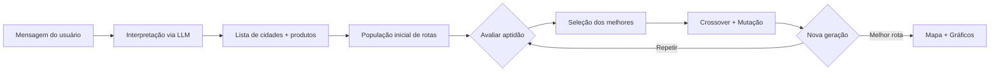

# Sistema de Otimização de Rotas Médicas (TSP)

Projeto desenvolvido para o **Tech Challenge — Fase 2** da pós-graduação **FIAP — IA para Devs (9IADT)**, Grupo 88.

A aplicação ajuda a montar rotas de entrega de **vacinas, medicamentos e insumos médicos** em municípios brasileiros, combinando interpretação de linguagem natural, otimização por **Algoritmo Genético** e visualização interativa em mapa.

**Integrantes:**
- Gustavo Denobi
- Gilberto Cunha
- Thiago Garbulha
- Vitor Arruda

---

## Índice

1. [O problema](#-o-problema)
2. [O objetivo](#-o-objetivo)
3. [Por que Algoritmo Genético?](#-por-que-algoritmo-genético)
4. [Visão geral do sistema](#-visão-geral-do-sistema)
5. [Como a aplicação funciona](#-como-a-aplicação-funciona)
6. [Instalação e execução](#-instalação-e-execução)
7. [Exemplos de uso](#-exemplos-de-uso)
8. [Tecnologias utilizadas](#-tecnologias-utilizadas)
9. [Estrutura do projeto — Backend](#-estrutura-do-projeto--backend)
10. [Estrutura do projeto — Frontend](#-estrutura-do-projeto--frontend)
11. [Parâmetros do Algoritmo Genético](#-parâmetros-do-algoritmo-genético)
12. [Regras e restrições](#-regras-e-restrições)
13. [Painel de análise e métricas](#-painel-de-análise-e-métricas)
14. [Referência acadêmica](#-referência-acadêmica)

---

## 📌 O problema

O desafio parte de uma variação do **Problema do Caixeiro Viajante (TSP — Traveling Salesman Problem)** aplicada à logística de saúde pública.

Imagine um veículo que precisa visitar vários municípios para entregar produtos médicos. Cada cidade deve ser visitada **exatamente uma vez**, a rota deve **começar e terminar no mesmo ponto** (cidade de partida), e o percurso total deve ser o mais curto possível — mas não é só isso: entregas de **maior urgência** (vacinas, classificadas como prioridade 1) precisam aparecer **o quanto antes** na sequência de visitas.

Com dezenas ou centenas de cidades, o número de rotas possíveis cresce de forma explosiva. Não é viável testar todas as combinações manualmente nem com força bruta. Por isso, o projeto adota uma abordagem evolutiva: o Algoritmo Genético explora o espaço de soluções de forma inteligente ao longo de várias gerações.

---

## 🎯 O objetivo

Implementar uma solução completa que:

1. **Entenda** o pedido do usuário em linguagem natural (ex.: *"entregar vacinas na região dos lagos do RJ e seringas na região serrana"*).
2. **Identifique** automaticamente os municípios e os produtos envolvidos.
3. **Calcule** a melhor ordem de visita, equilibrando **distância** e **prioridade de entrega**.
4. **Apresente** o resultado em um mapa interativo, com gráficos que mostram como o algoritmo evoluiu até chegar à rota final.

---

## 🧬 Por que Algoritmo Genético?

O TSP clássico já é um problema difícil (NP-difícil). Neste projeto, ele ganha uma camada extra: além de minimizar distância, a solução precisa **favorecer produtos prioritários no início da rota**. Isso torna ainda mais improvável encontrar a resposta ideal por tentativa e erro.

O **Algoritmo Genético (AG)** foi escolhido porque:

| Motivo | Explicação |
|---|---|
| **Espaço de busca enorme** | Com 10 cidades há milhares de rotas; com 90+, o número explode. O AG não precisa enumerar tudo — ele evolui um conjunto de candidatas. |
| **Flexibilidade** | É possível incorporar regras de negócio (como prioridade de produtos) diretamente na função de aptidão, sem redesenhar todo o algoritmo. |
| **Boa relação custo × qualidade** | Para problemas de logística em escala realista, o AG costuma encontrar soluções muito boas em tempo aceitável — especialmente com os parâmetros ajustáveis que o usuário controla na interface. |
| **Natureza inspirada na biologia** | Assim como na evolução natural, soluções "boas" são preservadas, combinadas e levemente alteradas; as "ruins" vão sendo descartadas ao longo das gerações. |

### Como o AG funciona, em termos simples

Cada rota candidata é um **indivíduo**. Um grupo de rotas forma a **população**. A cada **época** (geração), o sistema:

1. **Avalia** cada rota (aptidão = distância ajustada pela prioridade dos produtos).
2. **Seleciona** as melhores para serem "pais".
3. **Combina** duas rotas (crossover) para gerar filhos.
4. **Aplica mutações** aleatórias para explorar novas possibilidades.
5. **Repete** até atingir o número de épocas ou parar antecipadamente se não houver melhora.

O resultado final é a melhor rota encontrada ao longo de todo o processo.



---

## 🏗️ Visão geral do sistema

O sistema é dividido em **duas partes** que se comunicam via API:

| Parte | Tecnologia | Responsabilidade |
|---|---|---|
| **Backend** | Python + FastAPI | Interpretar a mensagem (ChatGPT), consultar bases de cidades e produtos, executar o Algoritmo Genético e devolver a rota otimizada |
| **Frontend** | React + Vite | Autenticação, formulário de parâmetros, mapa interativo e painel de análise com gráficos |

### Fluxo completo

```
Login → Descrição da rota (texto livre) → Configuração do AG → Processamento → Mapa + Análise
```

1. O usuário faz **login** (camada de proteção para evitar uso indevido da API e consumo de tokens da OpenAI).
2. Escreve em **linguagem natural** o que deseja entregar e em quais cidades ou regiões.
3. A **LLM (ChatGPT)** interpreta a mensagem e, com *function calling*, consulta os repositórios locais de cidades (IBGE) e produtos para montar a lista de entregas.
4. O **Algoritmo Genético** encontra a melhor ordem de visita.
5. O **frontend** exibe a rota no mapa (Leaflet) e os gráficos de evolução (Chart.js).

---

## 🔄 Como a aplicação funciona

### 1. Autenticação

A tela de login existe como **camada de segurança** para implantação em produção, evitando consumo indevido de tokens da OpenAI. Sem credenciais válidas, nenhuma outra tela é exibida.

- Credenciais fixas configuradas no `.env` do backend (`AUTH_USUARIO` e `AUTH_SENHA`).
- Após o login, um **token de sessão** é salvo no navegador (`localStorage`) e enviado em cada requisição protegida.
- O token expira automaticamente após **30 minutos**; o frontend agenda logout nesse momento e exibe aviso de sessão expirada.
- Qualquer resposta **401** da API (token ausente, expirado ou revogado) força logout imediato.
- O endpoint `POST /auth/logout` revoga o token ativo no servidor.
- Toda tentativa de login tem um atraso fixo de **1 segundo** no backend, para dificultar ataques de força bruta.
- Reiniciar o processo da API invalida todas as sessões (tokens ficam apenas em memória).

### 2. Campo de mensagem

O usuário descreve a rota em português, como faria com um colega de logística. Exemplos:

- *"Monte uma rota para entrega de vacinas da Covid 19 em todas as cidades da região dos lagos do estado do Rio de Janeiro e, na mesma rota, entregar seringas para a região serrana. A cidade de partida é Rio de Janeiro."*
- *"Entrega de vacinas em Duque de Caxias, Petrópolis e Teresópolis; seringas em Cabo Frio e Saquarema. Partida: Niterói."*

A LLM identifica:
- **Cidades** — por nome, região tradicional ou UF inteira, usando *function calling* para consultar o CSV local do IBGE.
- **Produtos** — vacinas, seringas, medicamentos etc., também resolvidos via funções locais.
- **Cidade de partida** — expressões como *"saindo de"*, *"partida é"*, *"origem em"*; quando identificada, é posicionada como primeiro item da rota.
- **Mensagens compostas** — blocos independentes (ex.: vacinas numa região + seringas em outra) são tratados separadamente, sem misturar produtos entre blocos.
- **Cidades fronteiriças** — quando o usuário pede municípios vizinhos de uma cidade, a LLM usa conhecimento geográfico próprio (o CSV não tem dados de adjacência).

Cada cidade recebe um código IBGE e cada produto um ID. São necessárias **ao menos 2 cidades** para calcular uma rota. A mensagem deve ter entre **20 e 500 caracteres**.

### 3. Parâmetros do Algoritmo Genético

O formulário permite ajustar todos os operadores genéticos (detalhados na [seção dedicada](#-parâmetros-do-algoritmo-genético)). Isso permite comparar estratégias e adaptar o tempo de execução ao tamanho do problema.

### 4. Mapa

Após o processamento, o mapa (Leaflet + OpenStreetMap) mostra:
- **Marcadores numerados** na ordem de visita (vermelho = prioridade 1, azul = prioridade 2).
- **Linha tracejada** conectando as cidades e fechando o loop de retorno à partida.
- **Popup** por cidade com nome, UF, produto e nível de prioridade.
- **Legenda** no canto inferior esquerdo com as cores e o total de cidades.

A rota é **circular**: começa e termina na cidade de partida. A cidade de partida aparece na lista de visitas, mas pode não ter produto associado quando serve apenas como ponto de origem.

### 5. Painel de análise

Ao lado do mapa, cards e gráficos ajudam a entender o resultado e o comportamento do algoritmo (detalhados na [seção de métricas](#-painel-de-análise-e-métricas)).

---

## 🚀 Instalação e execução

### Pré-requisitos

- **Python 3.12+**
- **Node.js 18+**
- Chave de API da **OpenAI** (obrigatória para interpretar mensagens em linguagem natural)

### Backend (`api-rotas-medicas/`)

```bash
cd api-rotas-medicas

# Criar e ativar ambiente virtual (recomendado)
python -m venv .venv
source .venv/bin/activate        # Linux/Mac
# .venv\Scripts\activate         # Windows

# Instalar dependências
pip install -r requirements.txt

# Configurar variáveis de ambiente
cp .env.example .env
# Editar .env e preencher:
#   OPENAI_API_KEY  — chave da OpenAI (obrigatório)
#   MODELO_CHAT     — ex.: gpt-4.1-mini
#   AUTH_USUARIO    — usuário de acesso ao frontend
#   AUTH_SENHA      — senha de acesso ao frontend

# Subir a API
uvicorn main:app --reload        # http://localhost:8000

# (opcional) Validar com testes automatizados
pytest tests/ -q
```

### Frontend (`frontend-rotas-medicas/`)

```bash
cd frontend-rotas-medicas

# Instalar dependências
npm ci                           # usa versões travadas do package-lock.json

# Subir o frontend (com o backend já rodando)
npm run dev                      # http://localhost:5173
```

O proxy do Vite redireciona automaticamente `/rotas`, `/auth` e `/health` para a API na porta 8000 — não é necessária configuração extra em desenvolvimento.

### Deploy em produção

**Backend:** o `Dockerfile` está preparado para ambientes como Cloud Run, com bind em `0.0.0.0` e porta configurável via variável `PORT`.

**Frontend:** em produção, configure `VITE_API_URL` no `.env` do frontend (veja `.env.example`) apontando para a URL pública da API. Sem essa variável, o build usa caminhos relativos e depende do proxy do Vite — válido apenas em desenvolvimento local.

---

## 📝 Exemplos de uso

Os exemplos abaixo foram testados na aplicação. Os tempos são aproximados e variam conforme o hardware e o tempo de resposta da OpenAI.

### Exemplo 1 — 10 cidades (~15 segundos)

**Mensagem:**
> Monte uma rota para:
> 1. Entrega de vacinas nas cidades: Duque de Caxias-RJ, Petrópolis-RJ, Teresópolis-RJ, Magé-RJ e Nova Friburgo-RJ.
> 2. Entrega de seringas para: Arraial do Cabo-RJ, Cabo Frio-RJ, Rio das Ostras-RJ e Saquarema-RJ.
> A cidade de partida é Niterói.

**Parâmetros sugeridos:** 500 épocas · população 100 · elite 20 · mutação 5% · seleção torneio · crossover ERX · inicialização aleatória · mutação swap + inversão · elitismo ativo · parada antecipada ativa · paciência 100

### Exemplo 2 — 23 cidades (~1 min 30 s)

**Mensagem:**
> Monte uma rota para entrega de vacinas da Covid 19 em todas as cidades da região dos lagos do estado do Rio de Janeiro e, na mesma rota, entregar seringas para as cidades da região serrana do estado do Rio de Janeiro. A cidade de partida é Rio de Janeiro.

**Parâmetros sugeridos:** 700 épocas · população 150 · elite 30 · mutação 9% · seleção torneio · crossover OX · inicialização vizinho mais próximo · mutação swap adjacente · elitismo desativado · parada antecipada desativada

### Exemplo 3 — 92 cidades (~2 minutos)

**Mensagem:**
> Monte uma rota para entrega de vacinas em todas as cidades da região serrana do estado do Rio de Janeiro e de seringas nas demais cidades do estado do Rio de Janeiro. A cidade de partida é o Rio de Janeiro.

**Parâmetros sugeridos:** 1000 épocas · população 200 · elite 40 · mutação 2% · seleção truncamento · crossover OX · inicialização vizinho mais próximo · mutação OR-opt · elitismo ativo · parada antecipada ativa · paciência 300

---

## 🛠️ Tecnologias utilizadas

### Backend

| Tecnologia | Papel no projeto | Por que foi usada |
|---|---|---|
| **FastAPI** | Framework da API REST | Rápido, moderno, com validação automática de dados via Pydantic e documentação interativa (Swagger) |
| **Pydantic** | Validação de entrada/saída | Garante que os parâmetros do AG chegam dentro dos limites esperados antes de qualquer processamento |
| **OpenAI API (ChatGPT)** | Interpretação de linguagem natural | Permite que o usuário descreva a rota em português livre, sem precisar selecionar cidades manualmente em listas |
| **Function Calling** | Ponte entre LLM e dados locais | O modelo consulta funções da API (pesquisar cidade, listar por região, buscar produto) em vez de "inventar" códigos |
| **python-dotenv** | Configuração por ambiente | Mantém chaves e credenciais fora do código-fonte |
| **pytest** | Testes automatizados | Valida operadores genéticos e autenticação de forma repetível |
| **Uvicorn** | Servidor ASGI | Executa a aplicação FastAPI em desenvolvimento e produção |

### Frontend

| Tecnologia | Papel no projeto | Por que foi usada |
|---|---|---|
| **React 18** | Interface do usuário | Componentização clara (login, formulário, mapa, painel) e reatividade ao estado |
| **Vite 5** | Build e dev server | Inicialização rápida e proxy automático para o backend |
| **Tailwind CSS** | Estilização | Layout responsivo e consistente com utilitários CSS |
| **Leaflet.js** | Mapa interativo | Exibe a rota geograficamente com marcadores, popups e polilinha — sem dependências pesadas |
| **Chart.js** | Gráficos de evolução | Visualiza como distância, aptidão e diversidade mudam ao longo das épocas |

### Dados

| Arquivo | Conteúdo |
|---|---|
| `data/cidades.csv` | Municípios brasileiros com código IBGE, nome, UF, latitude, longitude e região tradicional |
| `data/produtos.csv` | Produtos médicos com ID, nome e prioridade (1 = alta, 2 = baixa) |

A distância entre cidades é calculada pela **fórmula de Haversine**, que estima a distância em linha reta sobre a superfície da Terra a partir das coordenadas geográficas — padrão em aplicações de geolocalização.

---

## 📂 Estrutura do projeto — Backend

Diretório principal: `api-rotas-medicas/`

### Arquivos na raiz do backend

| Arquivo | O que faz |
|---|---|
| `main.py` | Ponto de entrada da API. Configura CORS, registra os routers de autenticação e rotas, e expõe `GET /health` para verificar se a API está operacional |
| `requirements.txt` | Lista de dependências Python com versões fixas |
| `.env.example` | Modelo das variáveis de ambiente (chave OpenAI, modelo, credenciais de login) |
| `Dockerfile` | Imagem Docker para deploy em nuvem (ex.: Cloud Run) |
| `teste_services.py` | Script manual para testar os serviços isoladamente (não faz parte da suíte automatizada) |

### `api/` — Camada HTTP

| Arquivo | O que faz |
|---|---|
| `dependencies.py` | Verifica se o token de autenticação é válido antes de permitir acesso aos endpoints protegidos |
| `routers/auth.py` | Endpoints de login (`POST /auth/login`) e logout (`POST /auth/logout`) |
| `routers/rotas.py` | Endpoint principal (`POST /rotas/`, protegido por token) — recebe a mensagem e parâmetros do AG, retorna a rota otimizada em GeoJSON |
| `schemas/auth.py` | Define o formato dos dados de login (usuário, senha, token) |
| `schemas/rotas.py` | Define e valida todos os campos do pedido de rota (mensagem, épocas, população, operadores genéticos etc.) |

### `models/` — Entidades do domínio

| Arquivo | O que representa |
|---|---|
| `cidade.py` | Um município com código IBGE, coordenadas geográficas, região tradicional e o produto a ser entregue. Calcula distância para outra cidade via Haversine |
| `produto.py` | Um item de entrega com nível de prioridade: **1** (alta — vacinas) ou **2** (baixa — insumos e medicamentos). A prioridade é definida no CSV e validada na criação do objeto |
| `individuo.py` | Uma rota candidata do Algoritmo Genético. O "cromossomo" é a lista ordenada de cidades, sempre começando e terminando na cidade de partida. A **aptidão** é `distância total − bonificação`, onde apenas cidades com produto de **prioridade 1** recebem bonificação por aparecerem mais cedo na rota |

### `services/` — Lógica de negócio

| Arquivo | O que faz |
|---|---|
| `llm_service.py` | Envia a mensagem do usuário ao ChatGPT com *function calling*. O modelo consulta cidades e produtos nos CSVs locais e devolve a lista de pares `{cod_ibge, produto_id}`. Trata mensagens com múltiplos blocos, identifica a cidade de partida e resolve cidades fronteiriças pelo conhecimento geográfico do modelo (sem usar o CSV) |
| `cidade_service.py` | Carrega e consulta o CSV de municípios do IBGE. Permite busca por nome, UF, região tradicional e código IBGE |
| `produto_service.py` | Carrega e consulta o CSV de produtos. Busca por nome com correspondência inteligente (evita confundir "vacina covid" com "vacina gripe") |
| `rota_service.py` | **Orquestrador principal**: recebe o pedido → chama LLM → monta cidades → executa o AG → devolve GeoJSON com métricas e histórico de evolução |
| `algoritmos_geneticos.py` | Implementa todos os operadores genéticos: inicialização (aleatória e vizinho mais próximo), seleção (truncamento e torneio), crossover (OX e ERX), mutação (swap adjacente, inversão, ambos e OR-opt), busca local 2-opt e cálculo de diversidade da população. O tamanho da população é limitado automaticamente a `(N−1)!` permutações possíveis |
| `auth_service.py` | Gerencia autenticação com usuário/senha fixos e tokens temporários em memória |

### `data/` — Bases de dados locais

| Arquivo | Conteúdo |
|---|---|
| `cidades.csv` | ~5.500 municípios brasileiros com coordenadas e região tradicional |
| `produtos.csv` | 11 tipos de produtos médicos com prioridade de entrega |

### `config/` — Configuração

| Arquivo | O que faz |
|---|---|
| `settings.py` | Lê o arquivo `.env` e expõe chave da OpenAI, modelo de chat e credenciais de autenticação |

### `tests/` — Testes automatizados

| Arquivo | O que valida |
|---|---|
| `test_algoritmos_geneticos.py` | Operadores genéticos isolados e combinações de seleção, inicialização, mutação e elitismo |
| `test_auth_service.py` | Emissão, validação, expiração e revogação de tokens de autenticação |

---

## 📂 Estrutura do projeto — Frontend

Diretório principal: `frontend-rotas-medicas/`

### Arquivos de configuração

| Arquivo | O que faz |
|---|---|
| `package.json` | Dependências do projeto (React, Leaflet, Chart.js, Tailwind) |
| `vite.config.js` | Configura o servidor de desenvolvimento e o proxy para a API backend |
| `tailwind.config.js` | Personalização do framework de estilos Tailwind CSS |
| `postcss.config.js` | Processamento de CSS (Tailwind + Autoprefixer) |
| `index.html` | Página HTML base que carrega a aplicação React |
| `.env.example` | Modelo da variável `VITE_API_URL` para apontar o frontend à API em produção |
| `COMANDOS.txt` | Comandos rápidos de instalação do frontend |

### `src/` — Código da interface

| Arquivo | O que faz |
|---|---|
| `main.jsx` | Inicializa a aplicação React no navegador |
| `App.jsx` | Componente raiz: controla autenticação (login/logout automático por expiração ou 401), estado da rota gerada, `formKey` para resetar o formulário e layout geral (sidebar + área principal) |
| `index.css` | Estilos globais, animações e diretivas do Tailwind |
| `config.js` | Define `API_URL`: vazio em desenvolvimento (usa proxy do Vite) ou URL da API em produção via `VITE_API_URL` |

### `src/components/` — Telas e blocos visuais

| Componente | O que faz |
|---|---|
| `LoginForm.jsx` | Tela de login com usuário e senha. Sem sessão válida, é a única tela exibida |
| `Sidebar.jsx` | Barra lateral com logo, botão "Nova Rota" (reinicia formulário e resultado), nome do usuário e logout |
| `RouteForm.jsx` | Formulário principal: campo de mensagem (20–500 caracteres), todos os parâmetros do AG com tooltips, popover de restrições do algoritmo, botão "Limpar" e validação que só habilita "Parada Antecipada" quando o elitismo está ativo |
| `MapView.jsx` | Mapa Leaflet com marcadores numerados, polilinha da rota, popups informativos e legenda de prioridades |
| `AnalysisPanel.jsx` | Painel de resultados: badge de rota válida/inválida, cards-resumo, gráficos de evolução, aviso de parada antecipada, épocas executadas e lista ordenada das cidades visitadas |
| `MedicalIllustration.jsx` | Ilustração exibida na tela inicial, antes de gerar a primeira rota |

---

## ⚙️ Parâmetros do Algoritmo Genético

Todos os parâmetros podem ser ajustados no formulário do frontend. Eles controlam **como** o algoritmo busca a melhor rota — não **o que** deve ser entregue (isso vem da mensagem em linguagem natural).

### Como o algoritmo evolui a cada época

Em termos simples, a cada geração o sistema:

1. **Avalia** todas as rotas da população (calcula distância e aptidão).
2. **Seleciona** as melhores para serem pais da próxima geração.
3. **Combina** duas rotas (crossover) para gerar filhos.
4. **Muta** alguns filhos aleatoriamente, conforme o grau de mutação.
5. **Opcionalmente** refina cada filho com busca local 2-opt.
6. **Preserva** os melhores da geração anterior, se o elitismo estiver ativo.

Esse ciclo se repete por N épocas — ou até a parada antecipada detectar que não há mais melhora.

> **Aptidão** é o valor usado para comparar rotas: `distância total − bonificação por prioridade 1`. **Quanto menor, melhor.** A seleção sempre prioriza rotas de menor aptidão, não necessariamente a menor distância pura.

---

### Épocas

**O que faz:** define quantas gerações o algoritmo executa.

**Efeito prático:** mais épocas dão mais tempo para a população evoluir e encontrar rotas melhores. Porém, depois de um certo ponto, o ganho costuma estagnar — épocas extras só aumentam o tempo de espera sem melhorar o resultado.

**Quando ajustar:**
- Poucas cidades (até ~15): 300–500 épocas costumam bastar.
- Dezenas de cidades: 700–1000 épocas.
- Com **2-opt ativado**, a convergência é mais rápida — vale reduzir épocas e população.

---

### População

**O que faz:** quantidade de rotas candidatas mantidas em cada geração.

**Efeito prático:** populações maiores exploram mais alternativas em paralelo e reduzem o risco de o algoritmo ficar preso numa solução medíocre cedo demais. O custo é tempo: cada época processa todas as rotas da população.

**Quando ajustar:**
- Problemas pequenos: 100–150.
- Problemas grandes (50+ cidades): 150–200.
- O tamanho é limitado automaticamente a `(N−1)!` permutações possíveis — com poucas cidades, não adianta colocar população maior que o número de rotas distintas existentes.

---

### Melhores (elite)

**O que faz:** quantos indivíduos são usados como **pais** para gerar a próxima geração. Com elitismo ativo, esse mesmo grupo também é **preservado sem alteração** na geração seguinte.

**Efeito prático:**
- Valor **muito baixo** → pouca diversidade, convergência rápida demais, risco de ótimo local.
- Valor **muito alto** → quase todas as rotas são parecidas, a evolução perde força.
- Regra prática: **15% a 25%** da população (ex.: população 200 → elite 20–40).

---

### Grau de mutação (0% a 10%)

**O que faz:** probabilidade de cada rota filha sofrer uma alteração aleatória após o crossover.

**Efeito prático:**
- **Baixo (1–3%):** preserva boas soluções já encontradas; bom quando a população já está convergindo.
- **Médio (5–7%):** equilíbrio entre exploração e estabilidade.
- **Alto (9–10%):** mais exploração, ajuda a escapar de mínimos locais, mas pode atrapalhar a convergência se mantido alto por muitas épocas.

**Dica:** em rotas com muitas cidades, taxas baixas (2–5%) costumam funcionar melhor; em problemas menores, taxas maiores permitem explorar mais.

---

### Elitismo

**O que faz:** decide se os melhores indivíduos de cada geração são **copiados intactos** para a próxima, sem passar por crossover ou mutação.

| Opção | Comportamento | Quando usar |
|---|---|---|
| **Ativado** (recomendado) | A melhor rota encontrada **nunca piora** entre gerações. A aptidão só melhora ou permanece igual. | Maioria dos casos; obrigatório para parada antecipada. |
| **Desativado** | Nenhuma rota é preservada — até a melhor pode ser descartada. A qualidade oscila entre épocas. | Quando se quer forçar mais diversidade e exploração, aceitando resultados menos estáveis. |

Com seleção por **torneio**, a elite é recalculada separadamente dos pais sorteados, para garantir que o melhor indivíduo real da população não se perca.

---

### Seleção

Define **como os pais** são escolhidos para gerar filhos.

#### Truncamento (padrão)
- Pega diretamente os N indivíduos de **menor aptidão**.
- Convergência **rápida e previsível**.
- Perde diversidade genética mais cedo — maior risco de ficar preso em solução não ideal.

#### Torneio
- Sorteia pequenos grupos aleatórios da população e escolhe o melhor de cada grupo.
- Soluções medianas ainda têm chance de ser pais → **mais diversidade**.
- Evolução mais lenta e menos previsível, mas pode escapar de ótimos locais que o truncamento não superaria.

---

### Crossover

Define **como duas rotas-pai se combinam** para gerar uma rota-filha.

#### OX — Order Crossover (padrão)
- Preserva um trecho da ordem de um pai e completa com cidades do outro na sequência em que aparecem.
- Bom equilíbrio entre manter sub-rotas promissoras e gerar diversidade.
- Operador clássico e versátil para o TSP.

#### ERX — Edge Recombination
- Reconstrói o filho priorizando **reaproveitar conexões** (pares de cidades consecutivas) presentes nos dois pais.
- Tende a produzir rotas melhores para o TSP puro, pois preserva "arestas boas".
- Custo computacional um pouco maior que o OX.

---

### Mutação

Define **como** uma rota pode ser alterada aleatoriamente quando a mutação é acionada.

| Operador | O que altera | Perfil |
|---|---|---|
| **Swap + Inversão** (padrão) | Troca vizinhos adjacentes e, em seguida, inverte um trecho da rota | Mais equilibrado; recomendado na maioria dos casos |
| **Swap adjacente** | Troca a posição de duas cidades vizinhas | Ajuste sutil e barato; converge devagar em ótimos locais distantes |
| **Inversão** | Inverte a ordem de um segmento inteiro | Exploração mais ampla; ajuda a desfazer cruzamentos no trajeto |
| **OR-opt** | Remove um segmento de 1–3 cidades e reinsere em outra posição | Realoca cidades a longa distância na rota; eficaz para escapar de ótimos locais, porém menos previsível |

---

### Inicialização da população

Define como a **primeira geração** de rotas é criada.

#### Aleatória (padrão)
- Todas as rotas começam embaralhadas aleatoriamente.
- **Máxima diversidade** no início.
- A qualidade inicial é baixa — exige mais épocas para melhorar.

#### Vizinho mais próximo
- Inclui **uma rota** construída pela heurística gulosa (sempre visita a cidade geograficamente mais próxima da atual).
- O restante da população continua aleatório.
- Acelera a convergência por já começar com uma solução razoável, mas reduz um pouco a diversidade inicial.

---

### Busca local 2-opt

**O que faz:** após cada crossover/mutação, testa pares de arestas da rota e **remove cruzamentos** que aumentam a distância (inverte trechos para encurtar o percurso).

**Efeito prático:**
- Melhora significativamente a qualidade de cada filho gerado.
- Em problemas com poucas cidades, pode convergir quase ao ótimo em poucas épocas.
- O custo cresce com o **quadrado** do número de cidades — deixa cada época muito mais lenta.

**Recomendação:** ao ativar, **reduza épocas e população**. O ganho por época compensa, mas o tempo por época aumenta bastante.

---

### Parada antecipada

**O que faz:** interrompe o algoritmo **antes** de completar todas as épocas, se a aptidão não melhorar por um número consecutivo de gerações.

**Requisito:** só funciona com **elitismo ativado**. Sem elitismo, a aptidão pode oscilar legitimamente entre gerações — a ausência de melhora não seria um sinal confiável para parar.

**Efeito prático:** economiza tempo quando o algoritmo já convergiu e está apenas repetindo soluções parecidas sem progresso.

---

### Paciência (épocas sem melhora)

**O que faz:** quantas épocas consecutivas **sem qualquer melhora na aptidão** são toleradas antes de encerrar (só tem efeito com parada antecipada + elitismo).

**Quando ajustar:**
- **Baixa (30–50):** para testes rápidos ou problemas pequenos.
- **Média (100):** uso geral.
- **Alta (200–300):** problemas complexos com muitas cidades, onde o algoritmo pode passar por platôs temporários antes de melhorar de novo.

Valores muito baixos arriscam parar cedo demais; valores muito altos anulam o benefício da parada antecipada.

---

### Combinações sugeridas por tamanho do problema

| Cenário | Épocas | População | Elite | Mutação | Seleção | Crossover | Init | Elitismo | Parada |
|---|---|---|---|---|---|---|---|---|---|
| ~10 cidades | 500 | 100 | 20 | 5% | Torneio | ERX | Aleatória | Sim | Sim (100) |
| ~23 cidades | 700 | 150 | 30 | 9% | Torneio | OX | Vizinho + próximo | Não | Não |
| ~90 cidades | 1000 | 200 | 40 | 2% | Truncamento | OX | Vizinho + próximo | Sim | Sim (300) |

Esses valores são pontos de partida testados no projeto — o ideal depende do hardware e do tempo aceitável de espera.

---

## 📊 Regras e restrições

### Restrições rígidas (sempre respeitadas)

- A rota **começa e termina** na mesma cidade de partida (rota circular).
- Cada cidade é visitada **no máximo uma vez**.
- A distância entre cidades é calculada via **Haversine** (coordenadas geográficas reais).
- Todas as cidades identificadas na mensagem devem aparecer na rota.

### Critério de otimização (flexível)

- A **aptidão** não é apenas a distância. Ela é calculada como:

  > **Aptidão = Distância total − Bonificação por prioridade 1**

- Apenas cidades com produtos de **prioridade 1** (vacinas) recebem bonificação por aparecerem **mais cedo** na rota.
- Quanto mais cedo a entrega prioritária, maior o bônus (até 100 km de bonificação por posição antecipada).
- Produtos de **prioridade 2** não recebem bonificação posicional — entram na rota apenas pela otimização de distância.
- Por isso, a aptidão pode ficar **negativa** — isso não é erro; significa que a bonificação de prioridade superou a distância, indicando que o algoritmo priorizou corretamente as entregas urgentes.

### Prioridades de produto

Conforme definido em `data/produtos.csv`:

| Prioridade | Tipo | Exemplos cadastrados |
|---|---|---|
| **P1 (alta)** | Vacinas | Vacina da Covid, Vacina da Gripe, Vacina BCG, Outras vacinas |
| **P2 (baixa)** | Insumos e medicamentos | Seringa, Gaze, Algodão, Remédio de Hipertensão, Remédio antialérgico, Outros medicamentos, Outros insumos |

---

## 📈 Painel de análise e métricas

Após gerar a rota, o painel lateral apresenta:

### Badge de validação

No cabeçalho do painel, um selo indica se a rota passou na verificação de integridade:
- **✓ Válida** — sem duplicatas, começa e termina na partida.
- **⚠ Inválida** — o cromossomo final não respeitou as regras; o resultado não é confiável.

### Cards-resumo

| Card | Significado |
|---|---|
| **Cidades** | Total de municípios na rota, incluindo a cidade de partida |
| **Distância** | Quilômetros percorridos (soma das pernas consecutivas, via Haversine) |
| **Aptidão** | Valor usado pelo AG para comparar rotas (distância − bonificação de prioridade 1). Quanto menor, melhor |
| **Avaliações** | Total de novas rotas (filhos) geradas e avaliadas durante toda a execução — mede o esforço real de busca, não apenas o número de épocas |

### Gráfico — Posição média por prioridade

Mostra **onde**, em média, cada tipo de produto aparece na rota (em % do percurso):

- **P1 (vermelho):** vacinas (única prioridade com bonificação na aptidão).
- **P2 (azul):** insumos e medicamentos (exibidos como contraponto, sem bonificação posicional).

Se vacinas aparecem com 30%, significa que, em média, estão no começo da rota. Com 70%, ficaram mais para o final. Esse gráfico ajuda a verificar se o algoritmo está antecipando corretamente as entregas urgentes.

### Gráfico — Evolução da distância

Mostra como a distância da melhor rota muda ao longo das épocas (amostrada periodicamente — a cada 10% das épocas, ou em intervalos menores quando a parada antecipada está ativa):

- Linha **descendo** = o algoritmo está encontrando rotas melhores.
- Linha **estável** = convergência (não há mais melhorias significativas).
- Se a **parada antecipada** foi acionada, um aviso amarelo informa em qual época o algoritmo parou por falta de melhora na aptidão.

### Gráfico — Aptidão e diversidade

Compara três curvas de aptidão (melhor, média e pior da população) e a **diversidade** (quão diferentes as rotas ainda são entre si):

- Se a diversidade cai muito cedo, a população ficou parecida demais — sinal de convergência prematura, que pode prender o algoritmo em uma solução não ideal.

### Lista de cidades

Sequência ordenada de visita com nome do município, produto associado e prioridade — permite conferir manualmente se a rota faz sentido logístico.

---

## 📄 Referência acadêmica

Este projeto atende ao **Tech Challenge da Fase 2** do curso **Inteligência Artificial para Devs (9IADT)** da FIAP, demonstrando a aplicação prática de:

- Algoritmos Genéticos para otimização combinatória
- Integração de LLMs com function calling para interpretação de linguagem natural
- Desenvolvimento full-stack (API + interface web)
- Visualização de dados geográficos e estatísticos
